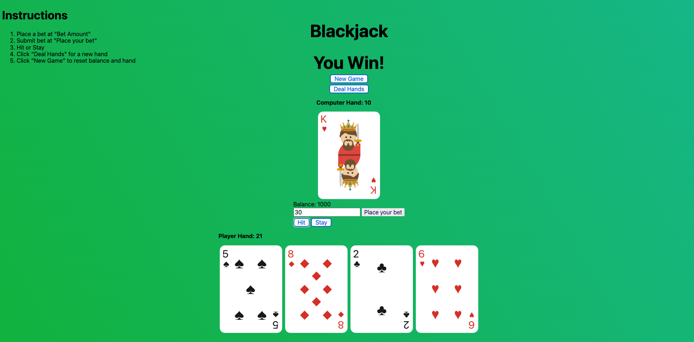

# Black-jack game

# How to play BlackJack

The aim of the game is to have a hand that totals higher than the dealer's without totalling 22 or higher. Picture cards are all worth **10 points**. An Ace is 11 points**. The points for all other cards is taken at **face value\*\*.

## Playing the game

1. The player can bet any amount up until the value of the balance. Once the bet is placed then the dealer deals the player two cards face up, whilst dealing themselves only one card face up. If a player is dealt an Ace and a 10 or picture card (see _Example 1_) then that player is instantly paid out (Blackjack!).

> _Example 1_ >  draw two cards which add up to 21 which is called Blackjack.

2. If the player has not hit Blackjack, the player can either choose to _hit_ or until either the player has exceeded a total hand value of 21, the player's hand total is 21 exactly or the player elects to _stay_.

> _Hit_: when you wish the dealer to deal you an additional card.
>
> > You may opt for this option if your total hand value is well below twenty-one i.e. 13.
> > _Stay_: when you do not want to draw anymore cards and wish the dealer to commence their turn
> > when your total hand value is close to 21 i.e. 19 or 20

3. Once the player has taken their turn, if the player hand total has not exceeded 21 or is 21 exactly, the dealer draws another card for their hand. The dealer must draw until their hand totals 17 or more.

## End of game

The player has three outcomes:

- Player wins
  > Player's hand total is closer to 21 than the dealer's
  > Player hits BlackJack
  > Player hits 21 after receiving their initial two cards
- Player loses
  > Dealer's hand total is closer to 21 than the player's
  > Dealer hits BlackJack
- Player draws with the dealer
  > Player and the dealer have the same hand total

## Payouts

- Blackjack: instant 3/2
- Player win: 2/1
- Player loses: No payout

This version is simplied Blackjack, for the original Blackjack rules please visit [Blackjack rules][Blackjack].

[Blackjack]: https://www.hippodromecasino.com/hippodrome-casino/blackjack/#:~:text=The%20object%20is%20to%20have,are%20counted%20at%20face%20value.
